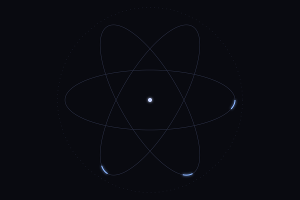

📌 <b>Quick Navigation</b>

 

- [About Me](#-about-me)
- [Skills](#-skills)
- [GitHub Stats](#-github-stats)
- [Connect With Me](#-connect-with-me)

 

## 🧑‍💻 About Me

- B.Tech CSE student at **Graphic Era Hill University, Bhimtal Campus** (2025–2029)
- Currently learning **Full Stack Development** and **Data Structures & Algorithms**
- Sharpening problem-solving on LeetCode
- Always open to collaborating on interesting projects

 

## 🛠 Skills

 

## 📫 Connect With Me

